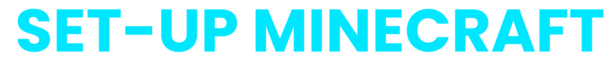

### Shortcuts

[](assets/docs/install-minecraft.md)
[](https://drive.google.com/drive/u/0/folders/1expguYgTjUxkGpnMVZYCzMNWrF-VKAHP)
[](https://drive.google.com/drive/u/0/folders/1zVUG5khpVl5C_pMYmL3IO9xMy03WYyUB)
[](https://drive.google.com/drive/u/0/folders/12r5TuwIdvtbbt_RJacWdFZ7pzLhuUHIU)
[](assets/docs/import-mods.md)
[](assets/docs/join-to-server.md)
[](assets/docs/use-shaders.md)
[](assets/docs/resourcepack.md)

---
<div align="center">  </div>
<div align="center">  </div>

---
##

# Aternos Server Address
```
yamimahu.aternos.me:63908
````

# Minecraft Version
`Fabric 1.21`

---

# Minecraft-Fabric⛏️

**Server Primary Requirements.**

1. Tlauncher Installed to your computer
2. Tlauncher Account
3. __Fabric 1.21__ Minecraft Version
4. Installed Mods

##
   ***Note:** The **GUIDES** BELOW WILL HELP YOU COMPLETE THE 4 REQUIREMENTS*
##
---

# GUIDES

<a href="assets/docs/install-minecraft.md">
    
</a>

<br>
<a href="https://drive.google.com/drive/folders/1o1ApSDh8yDyCc9X9AOIY6pbSmIzfAtn4?usp=drive_link">
    
</a>

<br>
<a href="assets/docs/import-mods.md">
    
</a>

<br>
<a href="assets/docs/join-to-server.md">
    
</a>
<br>

<a href="assets/docs/use-shaders.md">
    
</a>
<br>

<a href="assets/docs/resourcepack.md">
    
</a>
<br>

---

### We Value Your Feedback!
Have a moment to share your thoughts about my repository? I’d love to hear from you!

👉 [Click here to provide your feedback](https://forms.gle/hcPwKUXLbG2WCxSb8)

Your input will help improve and refine this project. Thank you for your time and support!


