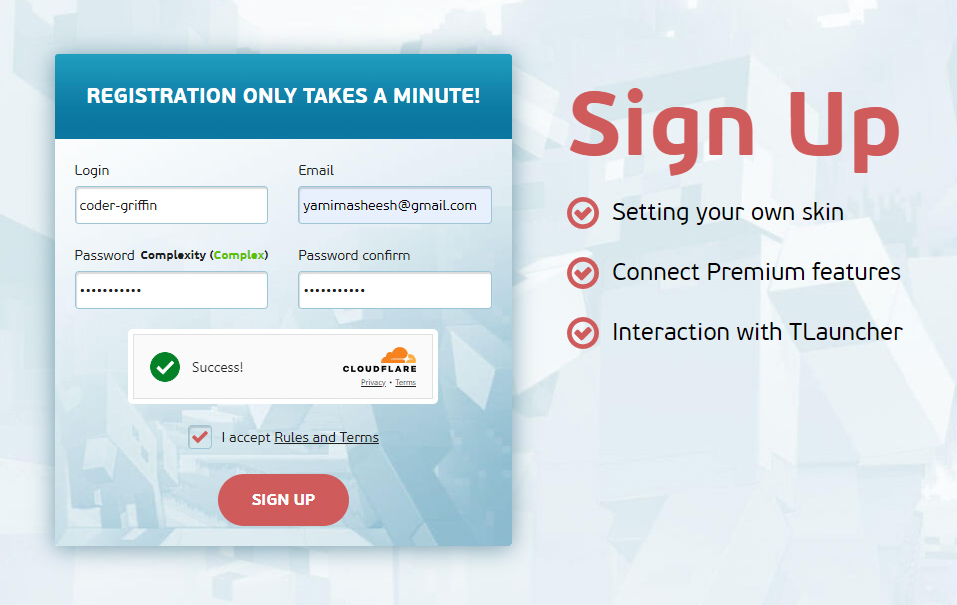
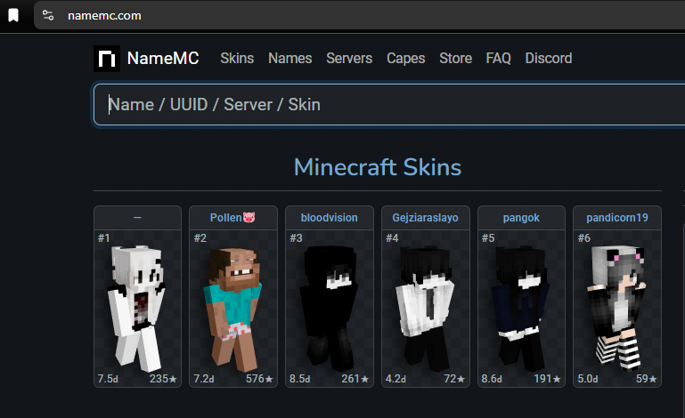

### Shortcuts

---

##

  

---

## 1. Download and Install TLauncher

  

- Step 1 : Visit the official website of **TLauncher**: https://tlauncher.org/en/

- Step 2 : Download **TLauncher** for **Windows**.

- Step 3 : Once the download is complete, run the executable file.

- Step 4 : Set up TLauncher by clicking "**Continue**" on all prompts and keeping the default settings until the installation is successful.

  

---

## 2. Create a TLauncher Account

[Register on the official TLauncher website.](https://tlauncher.org/en/reg/)

  

---

## 3. Download and Import a Skin 

Visit [NameMC](https://namemc.com/) to download a skin.

  

- Step 1 : Select a skin from NameMC and click the green "**Download**" button 🔽
- Step 2 : Log in to TLauncher and go to your profile: https://tlauncher.org/profile/
- Step 3 : Click "**Upload Skin**" and select the skin file you downloaded.

---

## 4. Add Your Account to the TLauncher Desktop App

  

- Step 1: Click on `(no account)` and select `Configure accounts...`
- Step 2 : Click `Add`
- Step 3 : Enter your TLauncher username and password, then click `Save an account`
- Step 4 : You're done!

---

## 5. Install and Select the Proper Version

### **Server Requirements:**
`Fabric 1.21`

To connect to the server, you must install the correct Minecraft version.
- If the version `Fabric 1.21` is not installed, select it and click __Install__.
- If `Fabric 1.21` is already installed, check the "`Force Update`" option, then click __Install__.

  

##
