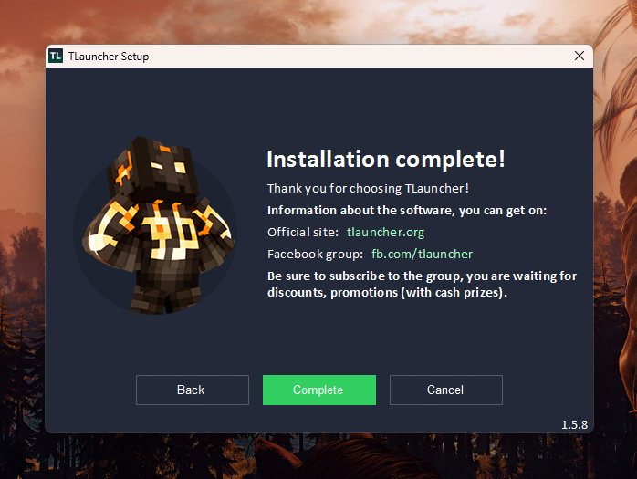

  

---

## 1. Download and Install TLauncher

  

- Step 1 : Visit the official website of `TLauncher` : https://tlauncher.org/en/

- Step 2 : Download TL For `Windows`

- Step 3 : After downloading, click the executable file

- Step 4 : Set-up your Tlauncher, just click all continues and keep it in default until the installation is successful

  

---

## 2. Create Tlauncher Account
