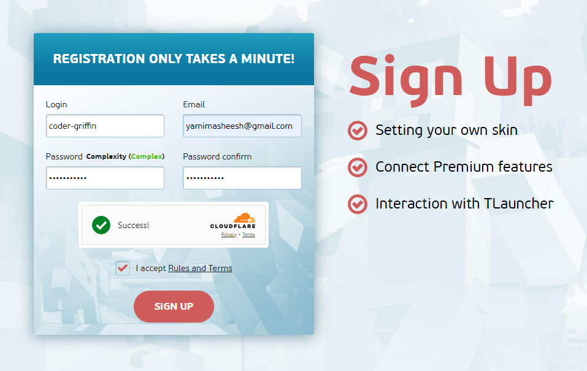

##

  

---

## 1. Download and Install TLauncher

  

- Step 1 : Visit the official website of `TLauncher` : https://tlauncher.org/en/

- Step 2 : Download TL For `Windows`

- Step 3 : After downloading, click on the executable file

- Step 4 : Set up TLauncher by clicking "Continue" on all prompts and keeping the default settings until the installation is successful

  

---

## 2. Create a TLauncher Account : https://tlauncher.org/en/reg/

  

---

## 3. Download and Import Skin : https://namemc.com/

  

- Step 1 : Select a skin from NameMC and click the green "Download" button 🔽
- Step 2 : Return to TLauncher and go to your profile: https://tlauncher.org/profile/
- Step 3 : Click "Upload Skin" and select the skin you downloaded

---

## 4. Add Your Account to the TLauncher Desktop App

  

- Step 1: Click on `(no account)` and select `Configure accounts...`
- Step 2 : Click `Add`
- Step 3 : Enter your TLauncher username and password, then click `Save an account`
- Step 4 : You're done!

---

## 5. Install and Select the Proper Version

**Our server requirements:**
`Fabric 1.21`

To connect, you must install the correct Minecraft version; otherwise, it will not work.
- After selecting the version `Fabric 1.21`, click **Install.**
- If the `Fabric 1.21` is already installed, you need to check the `Force Update`, click **Install**

  

##
